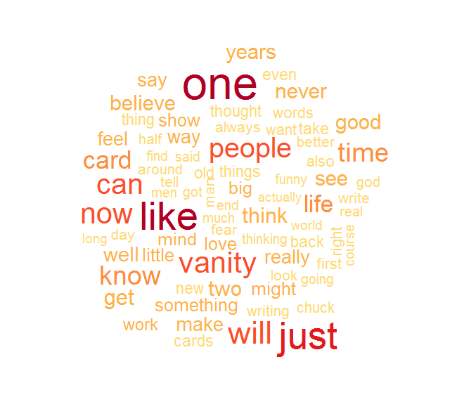

# Chuck Lorre Vanity Cards
Scrape and Analyze Chuck Lorre's Vanity Cards

## What?

The guy that created television shows like Dharma & Greg, Grace Under Fire (which I remember enjoying when I was young), and the Big Bang Theory.  He writes stuff and puts it at the end of his credits. 

#### A Quick Note

The Big Bang Theory often amuses me if I watch it, but sometimes the scientific terminology is wrong (I remember that one of the characters said negative reinforcement when he was really referring to punishment - he wanted to stop behavior) and I get so tired of people typing things like, "Oh my God! I watch the Big Bang Theory and I am such a nerd!". These are generally the same people that will bolster that claim by saying that they enjoy the "Avengers" movies.  This aside is really only to make me feel better about myself and has no real relevance. 

## Why?

These are things that I had seen at various points (I only watch his shows on occasion), but never really gave them too much attention. I find that I can enjoy most of his work, but I would not consider myself to be a "fan" of any of it.  Not too long ago, I saw a blurb about his most-complained-about vanity cards and it seemed as though there could be some interesting things to read. I cannot say that I was disappointed.  I figured it would be a good opportunity to have some fun.

Honestly, the having fun aspect is the biggest part.  Scraping data from the web is fun and is getting easier thanks to that fellow at RStudio (I did not have any problems with using xpaths in 'XML', but 'rvest' has made it even easier -- just like everything Hadley does). It always presents a good challenge, in that you never know if the content is going to be amenable to be scraped in an efficient manner. For this reason, I commend the person behind Chuck Lorre's vanity card site.

## The Process

As noted earlier, we will use 'rvest' to scrape the data. Here is just a brief snippet:

```r
# We need to get show names first.

shows = read_html("http://www.chucklorre.com/index.php") %>% 
  html_nodes("#sidebar a") %>% 
  html_attr("href") %>% 
  paste0("http://www.chucklorre.com/", .)
```

Eventually, we will have a dataframe full of text like this:

>Two things to know about what you just saw:

>One.  That was really Richard Feynman's van.

>Two.  Richard Feynman's van was not injured in the making of tonight's episode.

The text will be accompanied by the show in which it appeared and the original air date.

### Mild Disclaimer

I find these amusing. I enjoy some, but not others. I do not find any of them to be offensive, but I will not promise that someone else might not.

## The Goal

I think it will be fun to do some topic models on these texts.  Given that there are some additional variables to use (show and date), I think a structural topic model is in order. 

Plus, lot's of this:




Only because I know @mclark-- has a real affinity for them.

Wordcloud shenanigans and joking aside, the goal is to do some real neat stuff.